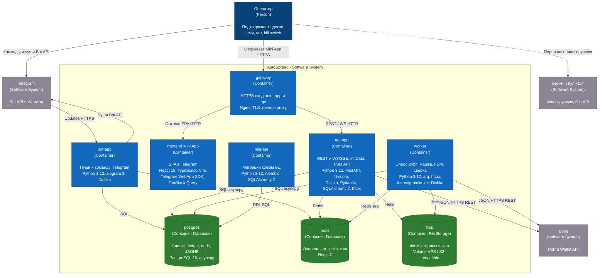

```mermaid
flowchart TB
  operator["Оператор<br/>(Person)<br/><br/>Подтверждает сделки,<br/>чеки, чат, kill switch"]

  subgraph boundary["AutoSpread - Software System"]
    direction TB
    migrate["migrate<br/>(Container)<br/><br/>Миграции схемы БД<br/>Python 3.12, Alembic, SQLAlchemy 2"]
    frontend["frontend Mini App<br/>(Container)<br/><br/>SPA в Telegram<br/>React 18, TypeScript, Vite,<br/>Telegram WebApp SDK, TanStack Query"]
    gateway["gateway<br/>(Container)<br/><br/>HTTPS вход: mini-app и api<br/>Nginx, TLS, reverse proxy"]
    api["api-app<br/>(Container)<br/><br/>REST и WS/SSE, initData, FSM API<br/>Python 3.12, FastAPI, Uvicorn,<br/>Dishka, Pydantic, SQLAlchemy 2, httpx"]
    bot["bot-app<br/>(Container)<br/><br/>Пуши и команды Telegram<br/>Python 3.12, aiogram 3, Dishka"]
    worker["worker<br/>(Container)<br/><br/>Опрос Bybit, маржа, FSM, сверка<br/>Python 3.12, arq, httpx,<br/>tenacity, aiolimiter, Dishka"]
    pg[("postgres<br/>(Container: Database)<br/><br/>Сделки, ledger, audit, JSONB<br/>PostgreSQL 16, asyncpg")]
    redis[("redis<br/>(Container: Database)<br/><br/>Очередь arq, locks, кэш<br/>Redis 7")]
    files[("files<br/>(Container: FileStorage)<br/><br/>Фото и скрины чеков<br/>Volume VPS / S3-compatible")]
  end

  bybit["Bybit<br/>(Software System)<br/><br/>P2P и Wallet API"]
  telegram["Telegram<br/>(Software System)<br/><br/>Bot API и WebApp"]
  banks["Банки и пул карт<br/>(Software System)<br/><br/>Фиат вручную, без API"]

  operator -->|Открывает Mini App HTTPS| gateway
  operator -->|Команды и пуши Bot API| telegram
  operator -.->|Переводит фиат вручную| banks

  gateway -->|Статика SPA HTTP| frontend
  gateway -->|REST / WS HTTP| api

  telegram -->|Updates HTTPS| bot
  bot -->|SQL| pg
  bot -->|Redis| redis
  bot -->|Пуши Bot API| telegram

  api -->|SQL asyncpg| pg
  api -->|Redis| redis
  api -->|Чеки| files
  api -->|JSON/HTTPS REST| bybit

  worker -->|SQL asyncpg| pg
  worker -->|Redis arq| redis
  worker -->|Чеки| files
  worker -->|JSON/HTTPS REST| bybit

  migrate -->|DDL SQL| pg

  classDef person fill:#08427B,stroke:#052E56,color:#ffffff
  classDef container fill:#1168BD,stroke:#0B4884,color:#ffffff
  classDef db fill:#2E7D32,stroke:#1B5E20,color:#ffffff
  classDef external fill:#8C8596,stroke:#6B6570,color:#ffffff

  class operator person
  class migrate container
  class frontend container
  class gateway container
  class api container
  class bot container
  class worker container
  class pg db
  class redis db
  class files db
  class bybit external
  class telegram external
  class banks external
```
