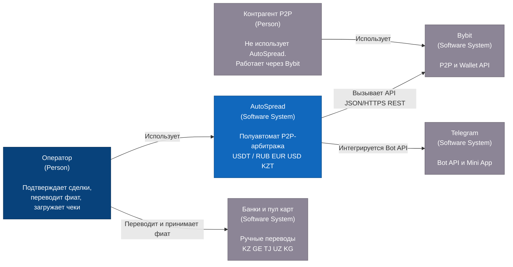

# [System Context] AutoSpread

Система, пользователи и внешнее окружение.

```mermaid
flowchart LR
  operator["Оператор<br/>(Person)<br/><br/>Подтверждает сделки,<br/>переводит фиат, загружает чеки"]
  counterparty["Контрагент P2P<br/>(Person)<br/><br/>Не использует AutoSpread.<br/>Работает через Bybit"]
  autospread["AutoSpread<br/>(Software System)<br/><br/>Полуавтомат P2P-арбитража<br/>USDT / RUB EUR USD KZT"]
  bybit["Bybit<br/>(Software System)<br/><br/>P2P и Wallet API"]
  telegram["Telegram<br/>(Software System)<br/><br/>Bot API и Mini App"]
  banks["Банки и пул карт<br/>(Software System)<br/><br/>Ручные переводы<br/>KZ GE TJ UZ KG"]

  operator -->|Использует| autospread
  autospread -->|Вызывает API JSON/HTTPS REST| bybit
  autospread -->|Интегрируется Bot API| telegram
  operator -->|Переводит и принимает фиат| banks
  counterparty -->|Использует| bybit

  classDef person fill:#08427B,stroke:#052E56,color:#ffffff
  classDef system fill:#1168BD,stroke:#0B4884,color:#ffffff
  classDef external fill:#8C8596,stroke:#6B6570,color:#ffffff

  class operator person
  class autospread system
  class counterparty external
  class bybit external
  class telegram external
  class banks external
```
